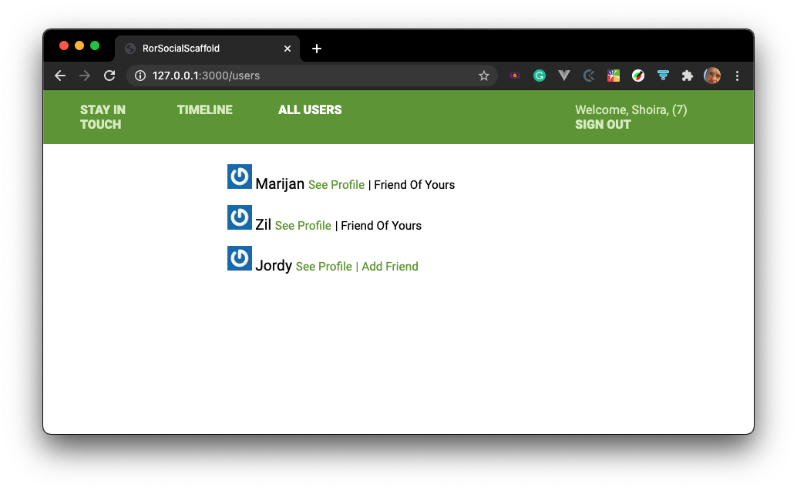

# Stay In Touch



> Stay In Touch is a social media app, built with Ruby on Rails. We used this repo with intial code for the app. Initial code was provided by Microverse.

## Built With
- Ruby v2.7.2
- Ruby on Rails v6.1.3
- Postgres: >=13.2

## Live Demo

[Stay in Touch Live Demo](https://stay-in-touch-zil.herokuapp.com)

## Getting Started

To get a local copy up and running, follow these simple example steps.
1. Position yourself in a working directory, e.g.: `~/work`
2. Run the following command  `git clone https://github.com/marijanbrvar/stay-in-touch.git && cd stay-in-touch`
3. To install prerequisites, just run `bundle install`
4. Now, we need to migrate the database. We assume you already install the Postgres server on your local machine
5. To enable the database for our application, run the following commands:
```
   rails db:create
   rails db:migrate
```
6. After all these steps are finished, you can run the application by calling `rails server`
7. Open the application in your browser at `http://localhost:3000/` and sign up with a new user. 

> How it works: you can invite your friend and theatergoer. You can try the app at the link [Stay in Touch Live Demo](https://stay-in-touch-zil.herokuapp.com)

### Prerequisites

Ruby: 2.7.2
Rails: 6.1.3
Postgres: >=13.2


### Testing with RSPEC

Run following command for unit and integration tests

'rspec'

### Github Actions in case when you Fork repo

To make sure the linters' checks using Github Actions work properly, you should follow the next steps:

1. On your recently forked repo, enable the GitHub Actions in the Actions tab.
2. Create the `feature/branch` and push.
3. Start working on your milestone as usual.
4. Open a PR from the `feature/branch` when your work is done.


### Usage

Start server with:

`rails server`

Open `http://localhost:3000/` in your browser.

### Run tests

`rpsec`

> Tests will be added by Microverse students. There are no tests for initial features in order to make sure that students write all tests from scratch.


## AUTHOR

**ZIL NORVILIS**

- Github: [](https://github.com/zilton7)
- Linkedin: [](https://www.linkedin.com/in/zil-norvilis/)
- Twitter: [](https://twitter.com/devnor7)

**MARIJAN BRVAR**

- GitHub: [@githubhandle](https://github.com/marijanbrvar)
- Twitter: [@twitterhandle](https://twitter.com/marijanbrvar)
- LinkedIn: [LinkedIn](https://linkedin.com/in/marijanbrvar)


## 🤝 Contributing

Contributions, issues, and feature requests are welcome!

Feel free to check the [issues page](https://github.com/marijanbrvar/stay-in-touch/issues).

## Show your support

Give a ⭐️ if you like this project!


## 📝 License

- This project is [MIT](https://github.com/marijanbrvar/stay-in-touch/blob/development/LICENSE) licensed.
- This project is [creativecommons](https://creativecommons.org/licenses/by-nc/4.0/) licensed.
